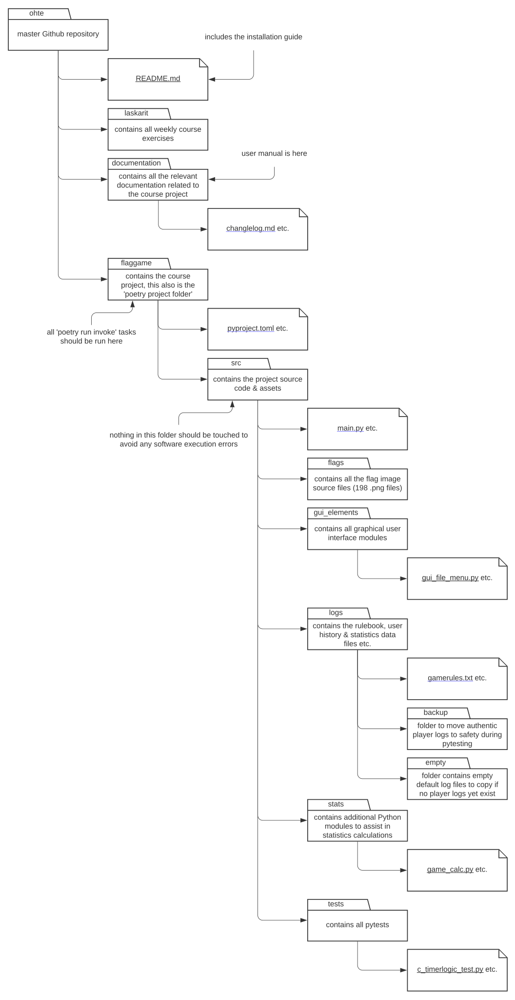

# SOFTWARE REPOSITORY STRUCTURE

# GAME HISTORY WRITING & READING

```mermaid
---
title: FLAG QUIZ GAME HISTORY SEQUENCE CHART
---
sequenceDiagram
    rect rgb(20, 20, 20)
    gui.py-)history.py: launch

    activate history.py
    history.py-->>history.txt: write NEW SESSION to file
    deactivate history.py

    gui.py->>history.py: request updated history
    activate history.py
    history.py-->history.txt: read history.txt
    history.py->>gui.py: return history
    deactivate history.py
    end

    rect rgb(30, 30, 30)
    gui.py-)gamehandler.py: game start
    activate gamehandler.py
    gamehandler.py->>history.py: game event triggers writer
    activate history.py
    history.py-->>history.txt: write GAME START to file
    deactivate history.py
    gamehandler.py->>gui.py: inform to update history
    deactivate gamehandler.py

    activate gui.py
    gui.py->>history.py: request updated history
    deactivate gui.py

    activate history.py
    history.py-->history.txt: read history.txt
    history.py->>gui.py: return history
    deactivate history.py
    end

    rect rgb(40, 40, 40)
    gui.py-)gamehandler.py: game finish
    activate gamehandler.py
    gamehandler.py->>history.py: game event triggers writer
    activate history.py
    history.py-->>history.txt: write GAME FINISH to file
    deactivate history.py
    gamehandler.py->>gui.py: inform to update history
    deactivate gamehandler.py

    activate gui.py
    gui.py->>history.py: request updated history
    deactivate gui.py

    activate history.py
    history.py-->history.txt: read history.txt
    history.py->>gui.py: return history
    deactivate history.py
    end

```

# REMAINING ISSUES WITH SOURCE CODE QUALITY & SOFTWARE LOGIC

There are some underlying issues still with the source code & game logic. While I think some areas of the software have been succesfully split into multiple Python modules and the responsibility has been divided in a good way (like the different [gui elements](../flaggame/src/gui_elements/)), there is a great deal of work to remain.

Pylint will currently raise some notes regarding too many statements, too many branches, and too many instance attributes. In particular, the [gamehandler](../flaggame/src/gamehandler.py) module is poorly designed and way too complex of a module to work with. It handles all the game logic, deals with user input, requests UI updates and sends calls for history & statistics recording. That's too much work from a single module. And while the actual calculation of the statistics is outsourced to other submodules, the [csvhandler](../flaggame/src/csvhandler.py) has too many tasks to perform.