# SOFTWARE MODULE ARCHITECTURE LAYOUT

```mermaid
---
title: FLAG QUIZ GAME MODULE ARCHITECTURE
---
classDiagram

main --|> gui
gui -- gamehandler
gui <-- rules
gui <-- csvhandler
gui <-- history
csvhandler <-- gamehandler
history <-- gamehandler
gamehandler -- flaghandler
gamehandler -- timerlogic
gui -- timerlogic

class main{
empty main.py module created to
dodge the circular import error
}

class gui{
- responsible for the graphical interface
- creates an underlying 4-tab structure
- other modules are free to update these tabs
- sends player actions and events to gamehandler
(tab0) : Game
(tab1) : History
(tab2) : Stats
(tab3) : Rules
}

class rules{
- reads the rulebook file, handles errors
- sends rules as text once to gui.tab3
}

class csvhandler{
- separate csv file used to keep track
of local machine all-time statistics
- updated after each game
- handles reading and writing
}

class history{
- reads and writes the game history,
handles any errors
- updated after each game
}

class gamehandler{
- responsible for all game logic
- handles every game mode
- updates GUI accordingly
- sends updates to history & statistics 
}

class flaghandler{
- manages the flag source image directory
- reads flag files and notifies if imports
fail or flags are missing
}

class timerlogic{
- utilizes the timeit library to read
accurate timings
- sends timing info constantly to gui
}

```

# GAME HISTORY WRITING & READING

```mermaid
---
title: FLAG QUIZ GAME HISTORY SEQUENCE CHART
---
sequenceDiagram
    rect rgb(20, 20, 20)
    gui.py-)history.py: launch

    activate history.py
    history.py-->>history.txt: write NEW SESSION to file
    deactivate history.py

    gui.py->>history.py: request updated history
    activate history.py
    history.py-->history.txt: read history.txt
    history.py->>gui.py: return history
    deactivate history.py
    end

    rect rgb(30, 30, 30)
    gui.py-)gamehandler.py: game start
    activate gamehandler.py
    gamehandler.py->>history.py: game event triggers writer
    activate history.py
    history.py-->>history.txt: write GAME START to file
    deactivate history.py
    gamehandler.py->>gui.py: inform to update history
    deactivate gamehandler.py

    activate gui.py
    gui.py->>history.py: request updated history
    deactivate gui.py

    activate history.py
    history.py-->history.txt: read history.txt
    history.py->>gui.py: return history
    deactivate history.py
    end

    rect rgb(40, 40, 40)
    gui.py-)gamehandler.py: game finish
    activate gamehandler.py
    gamehandler.py->>history.py: game event triggers writer
    activate history.py
    history.py-->>history.txt: write GAME FINISH to file
    deactivate history.py
    gamehandler.py->>gui.py: inform to update history
    deactivate gamehandler.py

    activate gui.py
    gui.py->>history.py: request updated history
    deactivate gui.py

    activate history.py
    history.py-->history.txt: read history.txt
    history.py->>gui.py: return history
    deactivate history.py
    end

```


