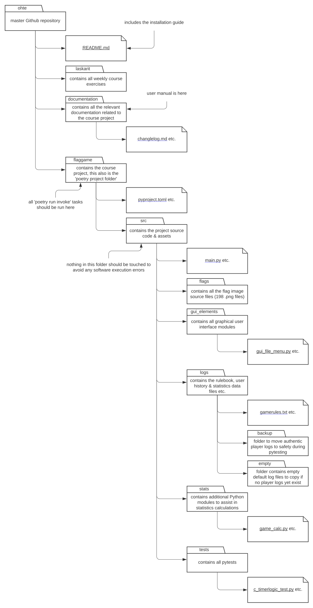
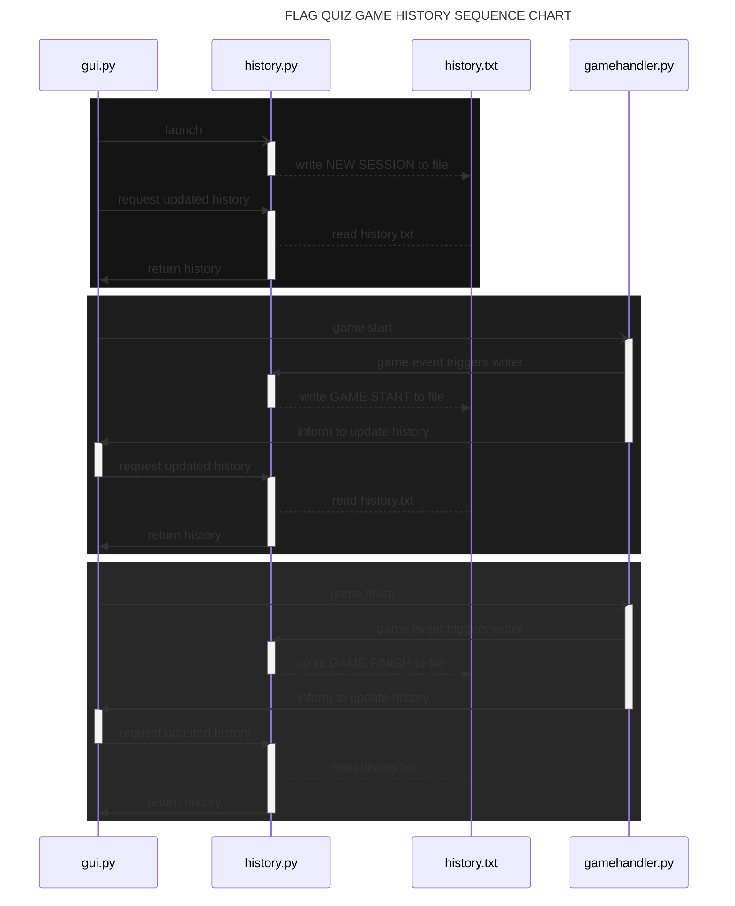

# SOFTWARE REPOSITORY STRUCTURE

# GAME HISTORY WRITING & READING

```mermaid
---
title: FLAG QUIZ GAME HISTORY SEQUENCE CHART
---
sequenceDiagram
    rect rgb(20, 20, 20)
    gui.py-)history.py: launch

    activate history.py
    history.py-->>history.txt: write NEW SESSION to file
    deactivate history.py

    gui.py->>history.py: request updated history
    activate history.py
    history.py-->history.txt: read history.txt
    history.py->>gui.py: return history
    deactivate history.py
    end

    rect rgb(30, 30, 30)
    gui.py-)gamehandler.py: game start
    activate gamehandler.py
    gamehandler.py->>history.py: game event triggers writer
    activate history.py
    history.py-->>history.txt: write GAME START to file
    deactivate history.py
    gamehandler.py->>gui.py: inform to update history
    deactivate gamehandler.py

    activate gui.py
    gui.py->>history.py: request updated history
    deactivate gui.py

    activate history.py
    history.py-->history.txt: read history.txt
    history.py->>gui.py: return history
    deactivate history.py
    end

    rect rgb(40, 40, 40)
    gui.py-)gamehandler.py: game finish
    activate gamehandler.py
    gamehandler.py->>history.py: game event triggers writer
    activate history.py
    history.py-->>history.txt: write GAME FINISH to file
    deactivate history.py
    gamehandler.py->>gui.py: inform to update history
    deactivate gamehandler.py

    activate gui.py
    gui.py->>history.py: request updated history
    deactivate gui.py

    activate history.py
    history.py-->history.txt: read history.txt
    history.py->>gui.py: return history
    deactivate history.py
    end

```
