# SOFTWARE ARCHITECTURE

## GENERAL SOFTWARE LAYOUT

Software is split into 4 different main sections, or "tabs", if you will; *Game*, *Stats*, *History*, and *Rules*. Software also utilizes a main menu with 4 drop-down menus; *File*, *Stats*, *Debug*, and *About*. These menus include functions to navigate and control the software.

The game tabs are designed as follows:

### GAME

**Game tab *is* the main game**. It's where the actual game is played. It has information about the current *game mode*, *game status*, and other information, such as *current round* and *lives count*. It has a *viewport* for the *current flag* to be displayed and 4 *buttons* for the player input. If no game is launched or game is over, buttons are "inactive".

### STATS

**Stats tab includes the player lifelong statistics**. It's also responsible for the browsing of previously played games (view can be switched from the Stats drop-down menu). **Stats are automatically rewritten *always* when a game is finished**.

### HISTORY

**History tab shows the player activity and software usage**. Software launch times and completed/terrminated games are visible here in more of a logbook-view. The view is not cluttered with numbers like in Stats. Both Stats and History can be completely erased from the File menu.

### RULES

**The game rulebook is always visible in the Rules tab**. It has detailed information about every game mode.

*A comprehensive guide detailing the software usage can be found [here](./user_manual.md)*.

## SOFTWARE LAUNCH & USAGE

Software launches straight away to the Game tab and **a new game can be immediately launched** from the File menu. Everything is visible straight away, *all menus and tabs can be seen at once*.

## PLAYER PERSONAL HISTORY & LONG-TERM MEMORY

**Software has long-term memory functionality** in the form of *software usage history*, *player activity*, and *player lifelong statistics*.

### HISTORY

**History combines the software and game launches into one chronological timeline**. It also keeps track whether a game is finished or terminated. This information is stored into a .txt file and *the data is formatted as an logbook straight into the file on disk*.

### STATISTICS

**The player lifelong statistics is a more complex system utilizing more of a database structure for data handling**. The software stores all rounds and streaks data into two corresponding .csv files on disk. Additionally, the complete record listing all played games is its own .csv file. *The lifelong statistics are calculated based on the data fetched from these .csv files*.

## SOFTWARE REPOSITORY STRUCTURE

This chart details the repository structure of the software.

## GAME HISTORY WRITING & READING

A sequence chart detailing the function call order during the history recording.

```mermaid
---
title: FLAG QUIZ GAME HISTORY SEQUENCE CHART
---
sequenceDiagram
    rect rgb(20, 20, 20)
    gui_history.py-)history.py: launch

    activate history.py
    history.py-->>history.txt: write NEW SESSION to file
    deactivate history.py

    gui_history.py->>history.py: request updated history
    activate history.py
    history.py-->history.txt: read history.txt
    history.py->>gui_history.py: return history
    deactivate history.py
    end

    rect rgb(30, 30, 30)
    gui_history.py-)gamehandler.py: game start
    activate gamehandler.py
    gamehandler.py->>history.py: game event triggers writer
    activate history.py
    history.py-->>history.txt: write GAME START to file
    deactivate history.py
    gamehandler.py->>gui_history.py: inform to update history
    deactivate gamehandler.py

    activate gui_history.py
    gui_history.py->>history.py: request updated history
    deactivate gui_history.py

    activate history.py
    history.py-->history.txt: read history.txt
    history.py->>gui_history.py: return history
    deactivate history.py
    end

    rect rgb(40, 40, 40)
    gui_history.py-)gamehandler.py: game finish
    activate gamehandler.py
    gamehandler.py->>history.py: game event triggers writer
    activate history.py
    history.py-->>history.txt: write GAME FINISH to file
    deactivate history.py
    gamehandler.py->>gui_history.py: inform to update history
    deactivate gamehandler.py

    activate gui_history.py
    gui_history.py->>history.py: request updated history
    deactivate gui_history.py

    activate history.py
    history.py-->history.txt: read history.txt
    history.py->>gui_history.py: return history
    deactivate history.py
    end

```

# REMAINING ISSUES WITH SOURCE CODE QUALITY & SOFTWARE LOGIC

There are some underlying issues still with the source code & game logic. While I think some areas of the software have been succesfully split into multiple Python modules and the responsibility has been divided in a good way (like the different [gui elements](../flaggame/src/gui_elements/)), there is a great deal of work to remain.

Pylint will currently raise some notes regarding too many statements, too many branches, and too many instance attributes. In particular, the [gamehandler](../flaggame/src/gamehandler.py) module is poorly designed and way too complex of a module to work with. It handles all the game logic, deals with user input, requests UI updates and sends calls for history & statistics recording. That's too much work from a single module. And while the actual calculation of the statistics is outsourced to other submodules, the [csvhandler](../flaggame/src/csvhandler.py) has also too many tasks to perform.
