# USER MANUAL

Complete user manual for software usage. Updated May 14th (ver 0.2.7). Latest release of the software source code can be found [here](https://github.com/joonarafael/ohte/releases).

## INSTALLATION

### 1. Clone this Github repository to your local machine by executing:

```bash
git clone https://github.com/joonarafael/ohte.git
```

### 2. Navigate to `./flaggame`.

This is the root folder for the Poetry project. Not the Github repository `ohte` (where this `README.md` file is located in).

### 3. Resolve Poetry dependencies by executing:

```bash
poetry install
```

### 4. Run the game in Poetry project master folder `./flaggame` by executing:

```bash
poetry run invoke start
```

For the full installation guide, see [README.md](../README.md). It also includes some tips & tricks for [possible Poetry errors](../README.md#troubleshooting-some-possible-poetry-errors), as well as for the [SQLite error](../README.md#software-test-coverage-report).

## CONTROLS

**Everything is controlled with the mouse cursor**. No keyboard input required at all.

## GRAPHICAL USER INTERFACE & SOFTWARE NAVIGATION

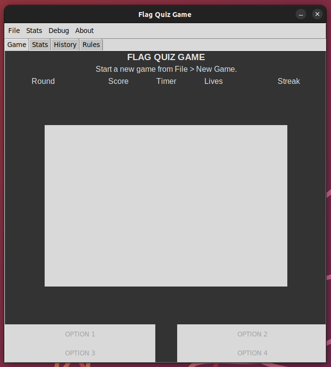

The game window is split into **4 different tabs**:

### Game

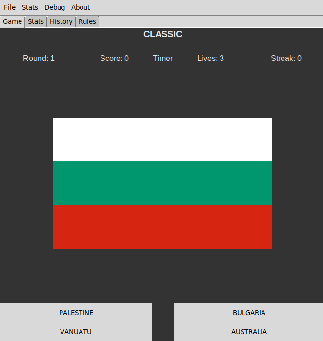

**Game tab includes the main game**. Current *game mode* (or e.g. a cancelled game), *answer feedback* (whether user's answer was right/wrong), and the *game status bar* (*current round*, *score*, etc.) are displayed at the top of the tab. *Viewport* beneath shows the *current flag*. Player answer is communicated with the 4 *buttons* located at the bottom of the tab. During *[Free Flag Browsing](./user_manual.md#free-flag-browsing)* player can shuffle through the flags with these 4 buttons.

### Stats

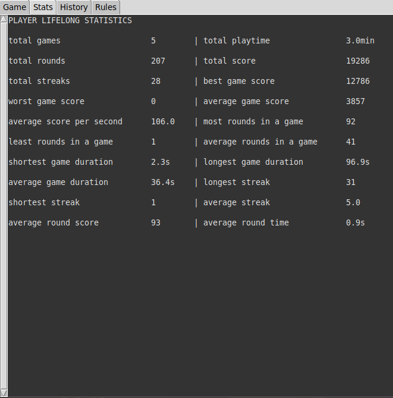

**Stats tab contains the Player Lifelong Statistics** and by switching the view from the [Stats menu](./user_manual.md#switch-game-browse-view), it shows the complete record of all games played. *Every system/machine has its own local database containing the statistics*. They're not synced through Github. **To ensure proper functionality of the statistics system, please do not manually modify/move/remove any of the data files within** `./flaggame/src/logs`. This applies to history recording as well. Software might run into errors if these files are modified externally by the user. Statistics and history can be erased from within the software. See [Clear history](./user_manual.md#clear-history).

### History

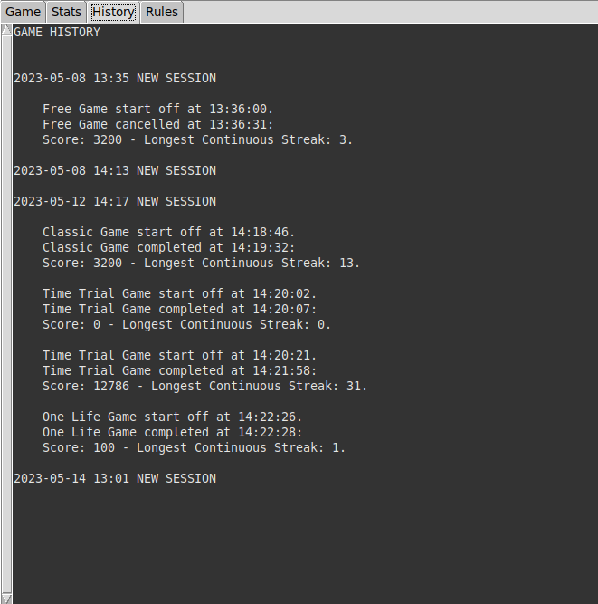

**Complete software usage history is displayed in the history tab**. In addition to all game events, it's also possible to view the software launch times from this tab. *Every system/machine has its own local history*. It's not synced through Github.

### Rules

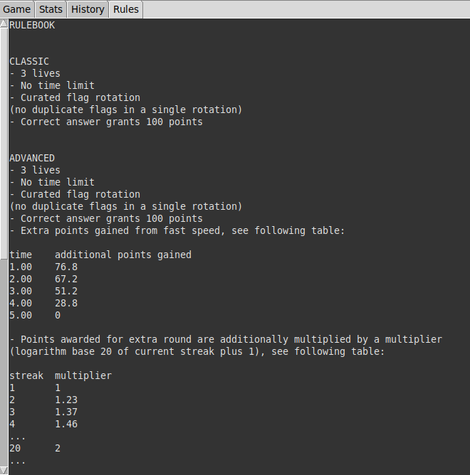

**The [game rulebook](../flaggame/src/logs/gamerules.txt) is constantly displayed in the Rules tab**. It includes detailed information about every game mode.

## MENUS

### FILE

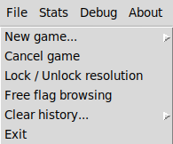

#### **New Game...**

Start a new game by selecting the game mode. Game modes include *Classic*, *Advanced*, *Time Trial*, *One Life*, and *Free Mode* (See [rulebook](../flaggame/src/logs/gamerules.txt) for details). Every game start is recorded to history. Game will be recorded and calculated into statistics if more than one round is played (excluding Time Trial, which is recorded anyways).

#### **Cancel Game**

Cancel any ongoing game. If an ongoing game is terminated, the current game state will be recorded to history & statistics. The "*Master GameHandler*" instance (responsible for all core game logic) receives **a complete reset** when a game is cancelled (good for debugging purposes if game logic gets stuck).

#### **Lock / Unlock Resolution**

Lock or unlock the master game window resolution. Locked window dimensions are printed to console. Default window resolution is 663x668.

#### **Free Flag Browsing**

Browse all 198 flags freely. **Any ongoing game will be terminated** (see [Cancel game](./user_manual.md#cancel-game)).

#### **Clear History...**

Option to clear the recorded history. Additionally all recorded statistics can be erased. **All saved progress will be lost**, software will exit.

#### **Exit**

Exit software. **Any ongoing game will be terminated** (see [Cancel Game](./user_manual.md#cancel-game)).

### STATS

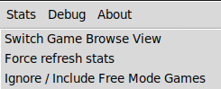

#### **Switch Game Browse View**

Toggle the view between "*Player Lifelong Statistics*" and "*All Recorded Games*".

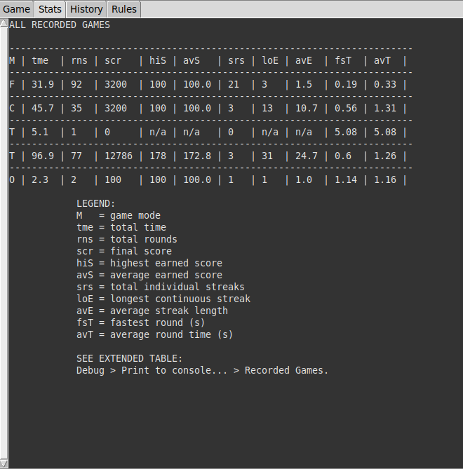

#### **Force Refresh Stats**

Option to force the *statistic refresh sequence* (mainly for debugging purposes).

#### **Ignore / Include Free Mode Games**

Select whether to include the Free Mode games in the statistics calculations or not. **Current preference is indicated in the title of the content (tab first row)**:

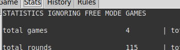

### DEBUG

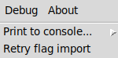

#### **Print to Console...**

Wide selection of different software *file paths*, *critical directories* and *statistics files* to get printed out to console for debugging purposes.

#### **Retry Flag Import...**

**Flag import sequence can be retried** still after software start. Games can't be launched if the total amount of flags found is not equal to 198.

### ABOUT

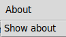

#### **Show About**

Show the software 'About' screen.
