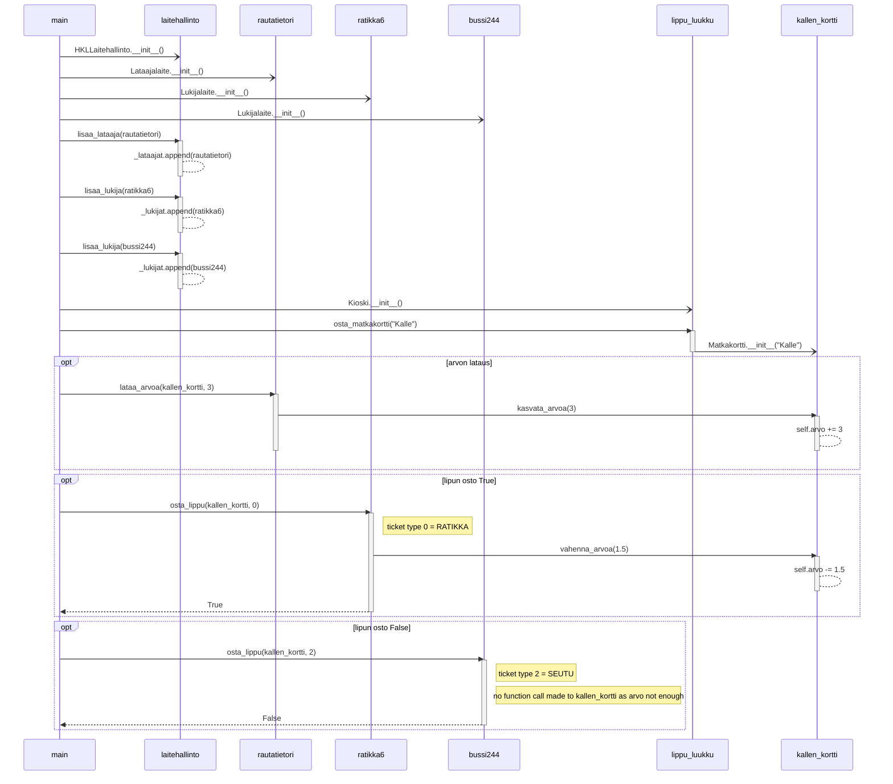

#Viikko 3, Tehtävä 4: Laajempi sekvenssikaavio

```mermaid
sequenceDiagram
    main -) laitehallinto: HKLLaitehallinto.__init__()
    main -) rautatietori: Lataajalaite.__init__()
    main -) ratikka6: Lukijalaite.__init__()
    main -) bussi244: Lukijalaite.__init__()

    main ->> laitehallinto: lisaa_lataaja(rautatietori)
    activate  laitehallinto
    laitehallinto --> laitehallinto: _lataajat.append(rautatietori)
    deactivate laitehallinto
    main ->> laitehallinto: lisaa_lukija(ratikka6)
    activate  laitehallinto
    laitehallinto --> laitehallinto: _lukijat.append(ratikka6)
    deactivate laitehallinto
    main ->> laitehallinto: lisaa_lukija(bussi244)
    activate  laitehallinto
    laitehallinto --> laitehallinto: _lukijat.append(bussi244)
    deactivate laitehallinto

    main -) lippu_luukku: Kioski.__init__()

    main ->> lippu_luukku: osta_matkakortti("Kalle")
    activate lippu_luukku
    lippu_luukku -) kallen_kortti: Matkakortti.__init__("Kalle")
    deactivate lippu_luukku
    
    opt arvon lataus
        main ->> rautatietori: lataa_arvoa(kallen_kortti, 3)
        activate rautatietori
        rautatietori ->> kallen_kortti: kasvata_arvoa(3)
        activate kallen_kortti
        kallen_kortti --> kallen_kortti: self.arvo += 3
        deactivate kallen_kortti
        deactivate rautatietori
    end

    opt lipun osto True
        main ->> ratikka6: osta_lippu(kallen_kortti, 0)
        activate ratikka6
        note right of ratikka6: ticket type 0 = RATIKKA
        ratikka6 ->> kallen_kortti: vahenna_arvoa(1.5)
        activate kallen_kortti
        kallen_kortti --> kallen_kortti: self.arvo -= 1.5
        deactivate kallen_kortti
        ratikka6 -->> main: True
        deactivate ratikka6
    end
    
    opt lipun osto False
        main ->> bussi244: osta_lippu(kallen_kortti, 2)
        activate bussi244
        note right of bussi244: ticket type 2 = SEUTU
        note right of bussi244: no function call made to kallen_kortti as arvo not enough
        bussi244 -->> main: False
        deactivate bussi244
    end
```
