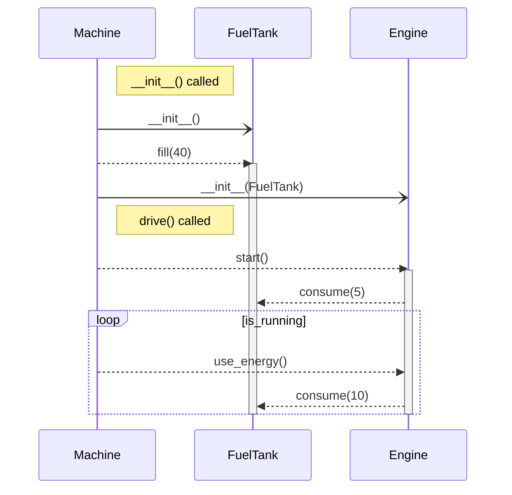

```mermaid
sequenceDiagram
    Note right of Machine: __init__() called
    Machine -) FuelTank: __init__()
    Machine -->> FuelTank: fill(40)
    activate FuelTank
    Machine -) Engine: __init__(FuelTank)
    Note right of Machine: drive() called
    Machine -->>  Engine: start()

    activate Engine

    Engine -->> FuelTank: consume(5)
    
    loop is_running
        Machine -->> Engine: use_energy()
        Engine -->> FuelTank: consume(10)
    end

    deactivate FuelTank
    deactivate Engine
```
