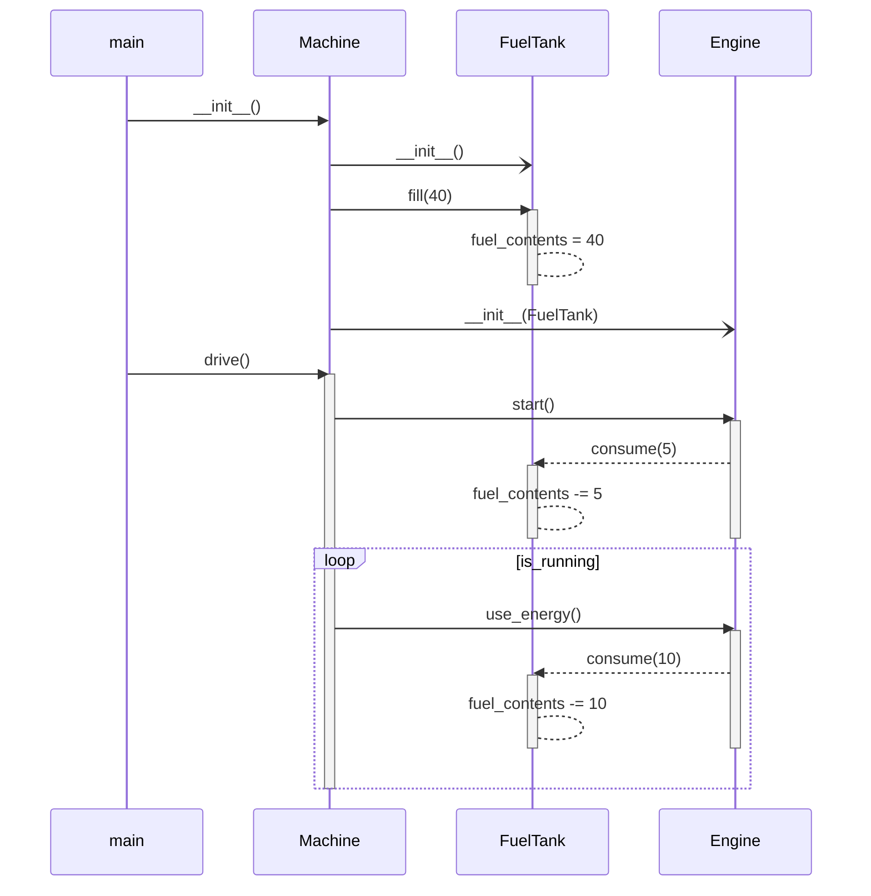

```mermaid
sequenceDiagram
    main ->> Machine: __init__()
    Machine -) FuelTank: __init__()
    Machine ->> FuelTank: fill(40)
    
    activate FuelTank
    FuelTank --> FuelTank: fuel_contents = 40
    deactivate FuelTank
    
    Machine -) Engine: __init__(FuelTank)
    
    main ->> Machine: drive()
    activate Machine
    Machine ->>  Engine: start()
    activate Engine
    Engine -->> FuelTank: consume(5)
    
    activate FuelTank
    FuelTank --> FuelTank: fuel_contents -= 5
    deactivate FuelTank
    deactivate Engine
    
    loop is_running
        Machine ->> Engine: use_energy()
        activate Engine
        Engine -->> FuelTank: consume(10)
        
        activate FuelTank
        FuelTank --> FuelTank: fuel_contents -= 10
        deactivate FuelTank
        deactivate Engine
    end
    
    deactivate Machine
```
